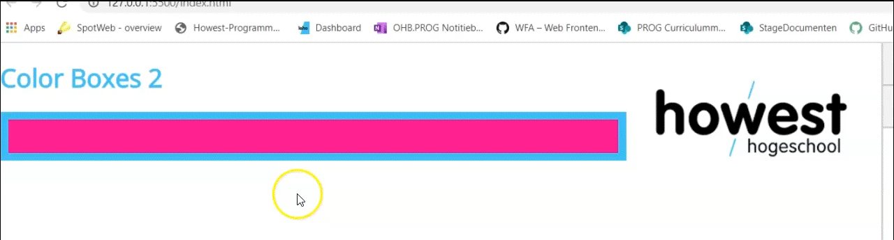

# ColorBoxes start repository

## StartSituatie
De HTML bevat een grid container met 3 boxes.
Er is reeds een start javascript file voorzien.

## Opdracht
Werk de javascript file verder af.
Maak gebruik van de correcte mousevents om elke box zwart te doen worden, wanneer de gebruiker er met de muisaanwijzer over gaat.

Wanneer de muisaanwijzer het element verlaat moet de kleur terug naar de originele toestand gaan.

Bekijk onderstaande afbeelding om de werking te zien:

**Extra**: Schrijf een `toggleColor` function die de kleur van een divBox kan switchen

**Extra**: Voorzie extra functionaliteit om de colorbox vast te zetten op zwart en ook om de toggle color functionaliteit opnieuw aan te zetten
